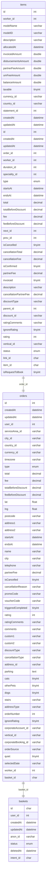

# SUMMARY

You have been give a sample data base with the following tables that represent a simplified version of one of our backend/application database:

```mermaid
erDiagram
    baskets {
        id char
        user_id int
        createdAt datetime
        updatedAt datetime
        anon_id varchar
        status enum
        deletedAt datetime
        intent_id char
    }
    items {
        id int
        worker_id int
        modelName varchar
        modelID varchar
        description varchar
        allocatedAt datetime
        invoicedAmount double
        disbursementsAmount double
        partnerFeeAmount double
        umFeeAmount double
        balanceAmount double
        taxable tinyint
        currency_id varchar
        country_id varchar
        statement_id int
        createdAt datetime
        updatedAt datetime
        id int
        createdAt datetime
        updatedAt datetime
        order_id int
        worker_id int
        duration_id int
        speciality_id int
        type enum
        startsAt datetime
        endsAt datetime
        total decimal
        totalBeforeDiscount decimal
        fee decimal
        feeBeforeDiscount decimal
        next_id int
        prev_id int
        isCancelled tinyint
        cancellationTotal decimal
        cancellationFee decimal
        isConfirmed tinyint
        partnerFee decimal
        invoiced tinyint
        description varchar
        cancellationPartnerFee decimal
        discountType varchar
        parent_id int
        discount_id varchar
        ratingComments varchar
        ignoreRating tinyint
        rating int
        vertical_id varchar
        status enum
        link_id char
        item_id char
        isRequestToBook tinyint
    }
    orders {
        id int
        createdAt datetime
        updatedAt datetime
        user_id int
        serviceArea_id varchar
        city_id varchar
        country_id varchar
        currency_id varchar
        timezone varchar
        type enum
        total decimal
        fee decimal
        totalBeforeDiscount decimal
        feeBeforeDiscount decimal
        lat float
        lng float
        postcode varchar
        address1 varchar
        address2 varchar
        startsAt datetime
        endsAt datetime
        name varchar
        city varchar
        telephone varchar
        partnerFee decimal
        isCancelled tinyint
        cancellationReason varchar
        promoCode varchar
        voucherCode varchar
        triggeredCompleted tinyint
        rating int
        ratingComments varchar
        comments varchar
        custom1 varchar
        custom2 varchar
        discountType varchar
        cancellationType varchar
        address_id varchar
        parking text
        cats tinyint
        otherPets tinyint
        dogs tinyint
        stairs varchar
        addressType varchar
        orderNumber int
        ignoreRating tinyint
        corporateAccount_id varchar
        vertical_id varchar
        corporateBooking_id varchar
        orderSource varchar
        quiet tinyint
        selectedDate varchar
        worker_id int
        basket_id char
    }
    items ||--|| orders : "order_id"
    orders ||--|| baskets : "basket_id"
```